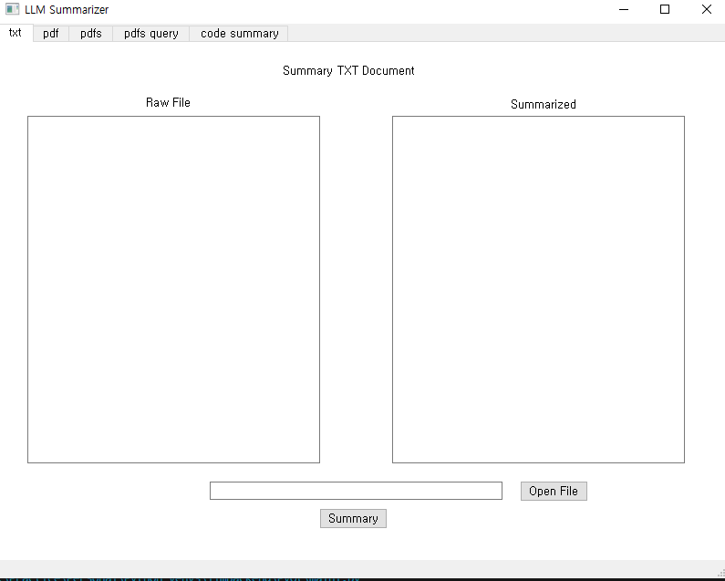
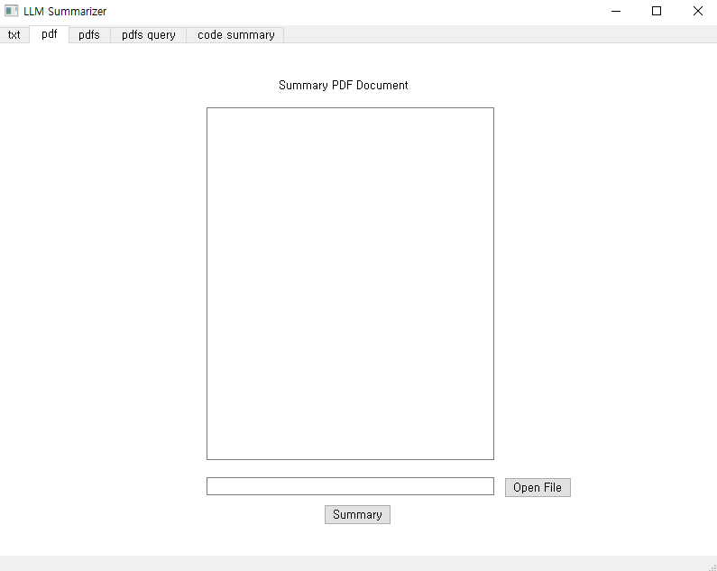
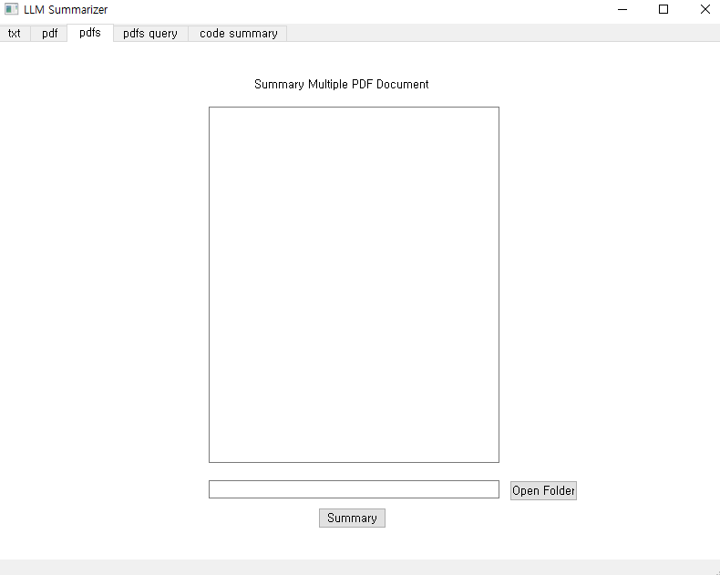
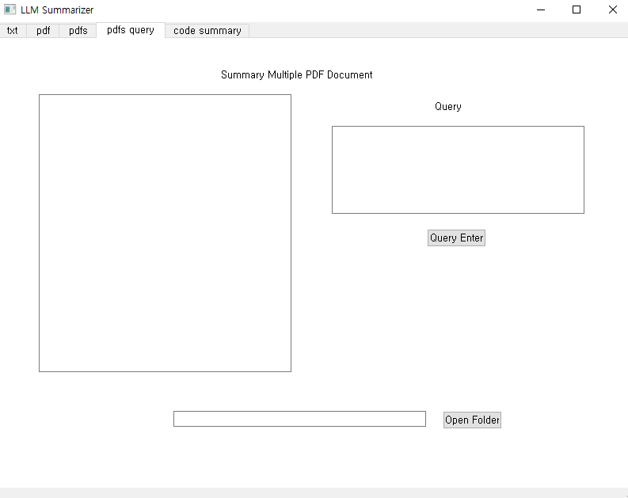
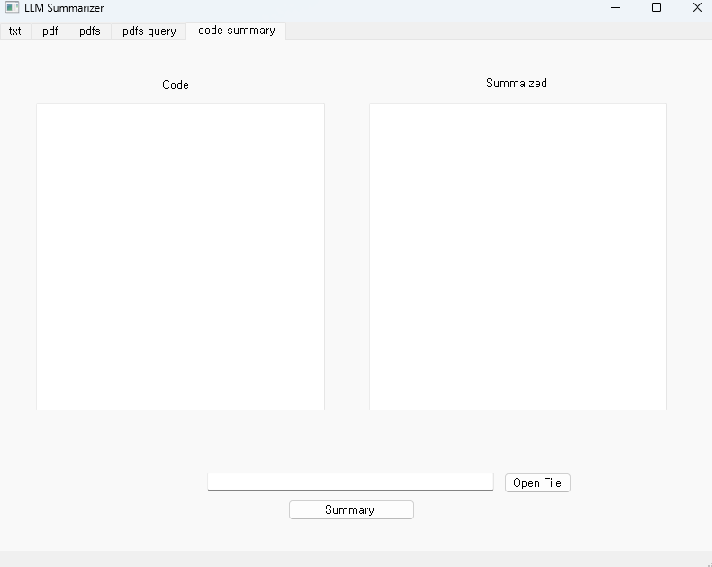

# LLM Summarizer

* txt, pdf 문서를 요약할 수 있고 pdf 문서에 대해 질문을 할 수 있다.
* python code가 하는 작업을 요약하여 주석으로 출력해준다.

## 필요성???

* 문서를 ctrl+c ctrl+v로 힘들게 요약할 필요 없이 로컬 디스크에 존재하는 문서 형태 그대로 불러와 요약 가능.
* 문서의 내용이 너무 많아 읽기 힘들 때, 읽기 전 내용의 핵심을 상기하고 싶을 때 사용.
* 문서를 읽어도 내용 파악이 잘 되지 않을 때, 질문을 할 수 있음.

## 어떻게 만들었나

* [LangChain](https://python.langchain.com/docs/modules/chains/popular/summarize.html)
* 해당 링크를 참조하여 만들었다.
    - map_template : 주어진 파이썬 코드를 요약하기 위한 프롬프트 엔지니어링 탬플릿
    - reduce_template: map_template대로 만들어진 요약을 출력하는 서식을 정하기 위한 프롬프트 엔지니어링 탬플릿
    - MAP_PROMPT, REDUCE_PROMPT : 탬플릿을 적용한 프롬프트
    - map_llm_chain, reduce_llm_chain : 모델과 프롬프트를 적용한 체인
    - generative_result_reduce_chain : 코드가 하는 작업을 설명한 code_description을 생성해 내는 체인
    - combine_documents : 위 작업들을 하나로 합친 체인
    - map_reduce : 완성된 맵 리듀스 체인
    
    - llm: 위 프롬프트 엔지니어링 거쳐서 만들어진 txt, pdf, python 파일 문서 요약기

## 어떻게 사용하나??

* txt 문서 요약 전, 후
    - openfile을 누른 후 txt파일을 선택하고 summary 버튼을 누르면 요약 실행
    
    

* pdf 문서 요약 전, 후
    - openfile을 누른 후 pdf파일을 선택하고 summary 버튼을 누르면 요약 실행
    
    

* pdf 문서 여러 개 요약 전, 후
    - openfolder를 누른 후 pdf파일이 있는 폴더를 선택하고 summary 버튼을 누르면 요약 실행
    
    

* pdf 문서 쿼리 전, 후
    - openfolder를 누른 후 pdf파일이 있는 폴더를 선택하고 query필드에 질문을 쓰고 query enter 버튼을 누르면 요약 실행
    
    

* code 요약 전, 후
    - code 필드에 code를 직접 작성하거나 copy & paste 하고 summary 버튼을 누르면 요약 실행
    - openfile을 누른 후 python 파일을 선택하고 summary 버튼을 누르면 요약 실행
    
    